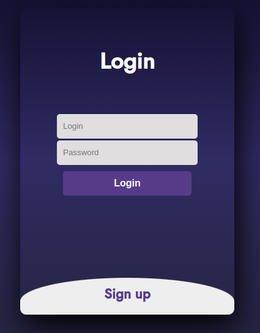
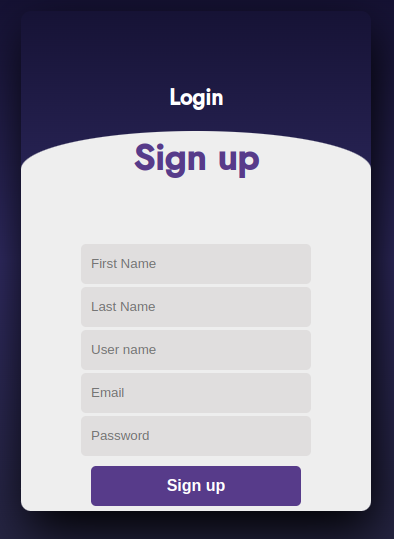
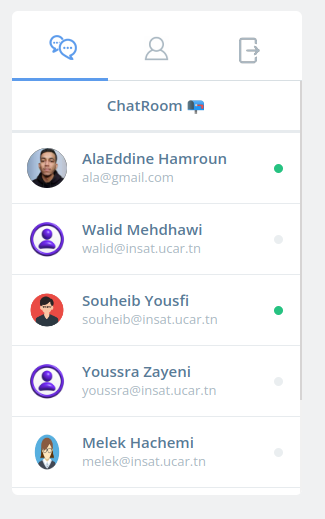
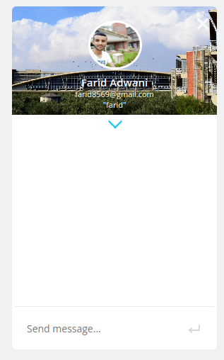
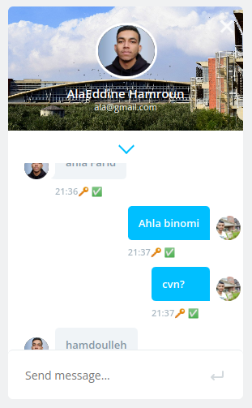
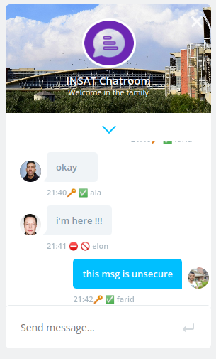
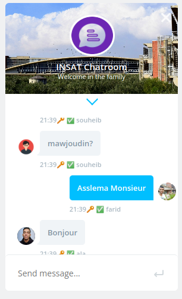
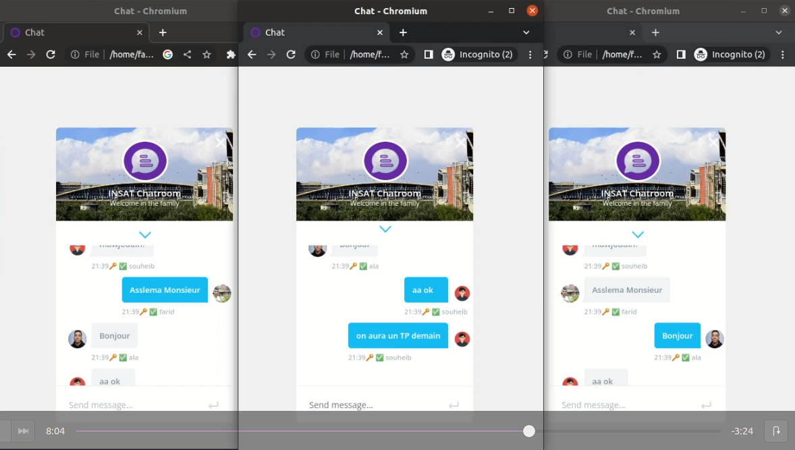

# Secure Chat 

This project is a secure messaging application that uses OpenSSL ,Web Sockets, LDAP, and PKI (Public Key Infrastructure) to implement x509 virtual entity hierarchy. The application has been developed using Python, and it includes a user-friendly web interface developped in JS , HTML , CSS (using Flask Library).

## Installation

1. Make sure you have Python and installed on your system.
2. Make sure you have LDAP server installed on your system with an entry name "insat" and an admin account with password "admin".
3. Clone the repository to your local machine using `git clone https://github.com/Farid-Adwani/Secure-Chat-Serrek-Fi-Bir.git`
4. Install the required dependencies using `pip install -r requirements.txt`
5. Run the application using `python3 main_server.py  localhost 1234` (example)
6. Open the HTML Page login.html in web directory

## Features

- Client validation and authentication using LDAP
- Security mechanisms based on public key certificates
- Certificate lifecycle management
- A messaging server that acts as a trusted authority, validating electronic certificates for clients and ensuring non-repudiation and authentication.
- User-friendly web interface
- Secure messaging using RSA public/private key encryption.

## Screenshots

## Demo

